# 安否確認システム

## 1.システム概要
災害時に従業員の安否確認を行うシステム。  
一斉メール配信や安否情報の集計機能を有する。

## 2.システム利用者

 - 管理者　主に部長職、または部長職に準じた者を対象とする。
 - 一般社員　部に配属されている社員を対象とする。

### ユースケース・業務シーケンス

## 3.機能一覧
| 機能名 | 管理者 |一般社員 |　機能概要 | 
|--|--|--|--|
| ログイン | ○ | × | 管理者がシステムにログイン |
| 安否確認メール送信 | ○ | × | 管理者が選択した対象者（複数）に対してメールを送信 |
| 安否報告確認 | ○ | × | 社員から報告された安否状況を一覧で確認 |
| 安否報告 | ○ | ○ | 社員が携帯に配信されたURLを元にシステムにアクセスし、安否報告を行う |

## 4.機能概要
### 4-1.ログイン・ログアウト
- 管理者は個別に配布されたIDとパスワードでシステムにログインする。  
- 作業後にログアウトする。  
(ohanaの機能を利用出来れば当機能実装不要)  

### 4-2.安否確認メール送信
- 安否確認を行う対象者を選択し、安否確認のメールを送信する。  
- 社員名前、部署での絞り込み検索、ソート機能。  
- 安否確認メールは、期間限定メール(Capability URLs)として送付され、安否報告画面へはログイン不要とする。  

### 4-3.安否報告確認
- 報告された安否状況を確認。  
- 安否確認の内容は3種類、各ステータスを表示する。  
- メール送信日時、送信者、社員名前、部署での絞り込み検索、ソート機能。  

### 4-4.安否報告
- 社員は送付されたURLにアクセスをし、安否状況を報告する。  
- 既に回答済みの安否報告に関しては、回答の編集を出来ないものとする。

## 5.データモデリング

## 6.開発環境
ペンディング
